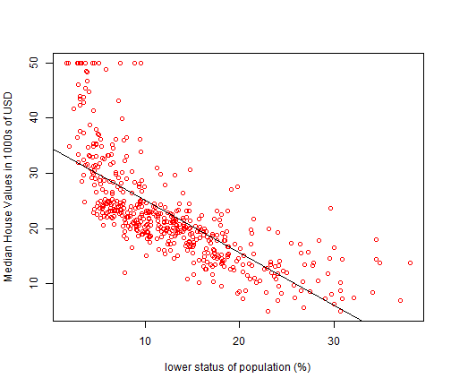

---
title       : Developing Data Products
subtitle    : Final Project
author      : Balakrishna Padmanabhan
job         : 
framework   : io2012        # {io2012, html5slides, shower, dzslides, ...}
highlighter : highlight.js  # {highlight.js, prettify, highlight}
hitheme     : tomorrow      # 
widgets     : []            # {mathjax, quiz, bootstrap}
mode        : selfcontained # {standalone, draft}
knit        : slidify::knit2slides
--- .class #id 

## Introduction

This presentation is a pitch for the Shiny Application that has been created as part of the final course
project.  The main aims of the app are as follows:

* Use the Shiny App as tool to allow for easy exploration of data and project results before publishing.
* Demonstrate the effectiveness of Shiny Apps in sharing results to a data science team and stake holders.

--- .class #id 
## The App

* The app uses the Boston data set in the MASS library.  
* The data set records the median house value for 506 neighborhoods around Boston.  * * The app seeks to predict the median house value using 13 predictors, such as rm (average number of rooms per dwelling), age (average age of the houses) and lstat (percent of households with low socioeconomic status).
* The app plots the median house value versus one of the predictors chosen.
* The predictors are chosen using a selection box.
* Linear regression line against the chosen predictor is shown in the plot.
* Summary of the linear regression model is shown in space below the plot.  
* The app can be found at [https://balapad.shinyapps.io/Coursera_Project/](https://balapad.shinyapps.io/Coursera_Project/)


--- .class #id 
## The App Output (The Plot)



--- .class #id 
## The App Output (Summary)

```
## 
## Call:
## lm(formula = medv ~ lstat, data = myData)
## 
## Residuals:
##     Min      1Q  Median      3Q     Max 
## -15.168  -3.990  -1.318   2.034  24.500 
## 
## Coefficients:
##             Estimate Std. Error t value Pr(>|t|)    
## (Intercept) 34.55384    0.56263   61.41   <2e-16 ***
## lstat       -0.95005    0.03873  -24.53   <2e-16 ***
## ---
## Signif. codes:  0 '***' 0.001 '**' 0.01 '*' 0.05 '.' 0.1 ' ' 1
## 
## Residual standard error: 6.216 on 504 degrees of freedom
## Multiple R-squared:  0.5441,	Adjusted R-squared:  0.5432 
## F-statistic: 601.6 on 1 and 504 DF,  p-value: < 2.2e-16
```
